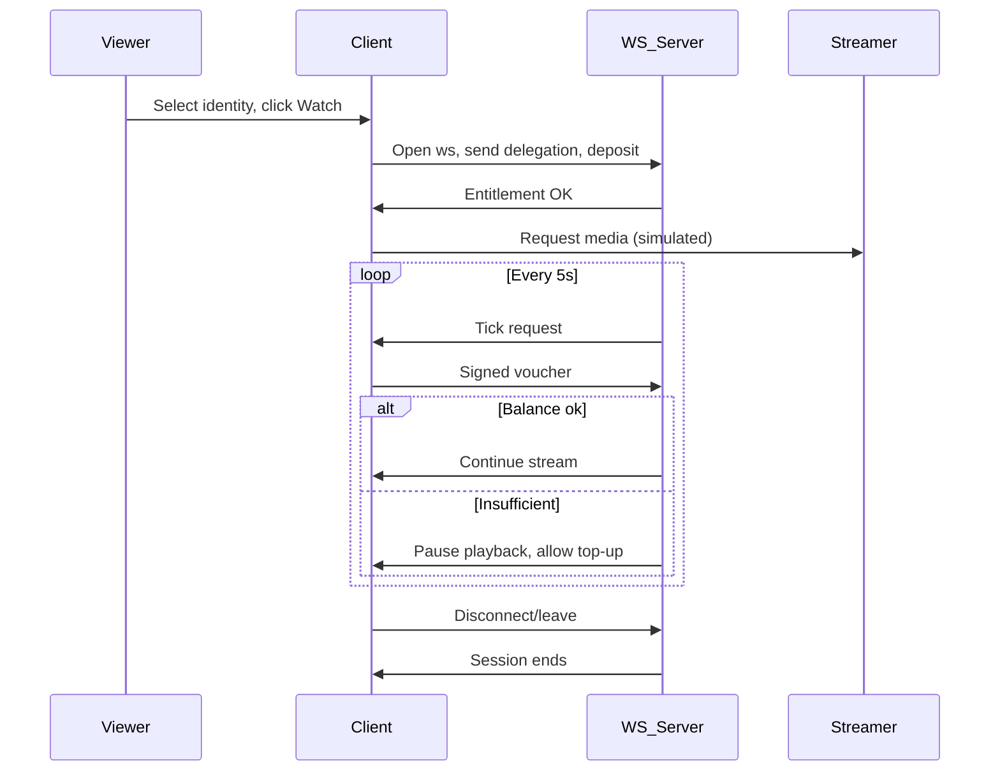

## Stream-POC Product Requirements Document

### Goals
- Prove real-time, payment-gated video session architecture using raw WebSocket and simulated media stream.
- Validate direct, instant, non-custodial payments from viewer to streamer using Tempo-style session vouchers.
- Minimize complexity: single global price, one active stream, deterministic demo identities, in-memory state only.

### Non-Goals
- No production auth, wallet management, or security hardening.
- No real video ingest or CDN integration.
- No multi-stream catalog, chat, or advanced features.

---

### Demo Flow (End-to-End)
1. Streamer identity selects "Go Live" (hardcoded, single stream).
2. Viewer selects identity from dropdown, clicks "Watch".
3. Viewer signs a 24-hour session delegation (simulated, in-memory key).
4. Client opens ws payment session to server.
5. Server checks deposit (must cover 12 ticks = 1 minute at global price).
6. If ok, server sends entitlement OK; simulated media stream starts.
7. Every 5 seconds, server charges one tick, verifies voucher, and continues stream.
8. If balance insufficient, playback pauses, ws session stays alive for 30s for top-up.
9. On disconnect or session end, all state is lost (in-memory only).

---

### Sequence Diagram

---

### Protocol / Message Shapes

- **ws:join** `{ identity, delegation, deposit }`
- **ws:entitlement** `{ ok: true, price, tickInterval }`
- **ws:tick** `{ tick, price }`
- **ws:voucher** `{ tick, signature }`
- **ws:pause** `{ reason }`
- **ws:resume** `{}`
- **ws:disconnect** `{}`

---

### App Structure (apps/stream-poc)

- `app/`
  - `page.tsx` — main UI, identity selection, Watch button, simulated player
- `server/`
  - `ws-server.ts` — Node ws server, in-memory state, tick logic
- `lib/`
  - `identities.ts` — fixed demo identities and addresses
  - `price.ts` — hardcoded global price
  - `sim-stream.ts` — simulated media chunk generator

---

### Implementation Phases

1. Bootstrap Next.js app in apps/stream-poc
2. Add ws server with join, entitlement, tick, voucher, pause/resume
3. Implement deterministic identity selection and delegation
4. Simulate media stream playback (text or fake video chunks)
5. Enforce minimum deposit, tick billing, and pause/resume
6. Manual test: join, watch, pause on insufficient funds, resume on top-up

---

### Acceptance Criteria
- [ ] Viewer cannot watch unless deposit covers 12 ticks
- [ ] Playback pauses if balance runs out, resumes on top-up
- [ ] All state is in-memory, reset on restart
- [ ] Only one stream and one price for all
- [ ] Demo identities selectable for both streamer and viewer
- [ ] No real wallet integration, but voucher signing is simulated